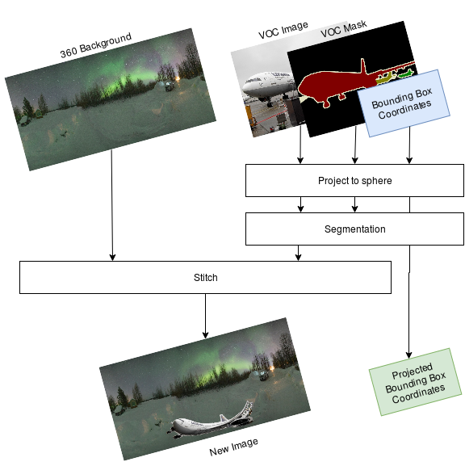
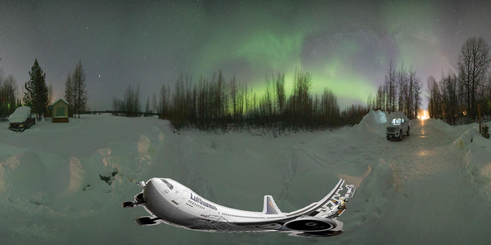

# TRDP-Database-generator

This repository contains functions developed in Matlab for generating an spherical image dataset in the Pascal VOC format. This project was developed for the [IPCV](http://ipcv.eu/) Tutored Research and Development Project titled "Object Detection in Wide-Angle/Immersive Image Formats". The goal of this dataset is to contain objects with multiple levels of distortion with annotations for object detection.

## Prerequisites

- VOC dataset and VOCDevKit.
- [PanoBasic](https://drive.google.com/drive/folders/1X2AB3FmeSr3eSPeiLO4CSWP-1iOdJKHd?usp=sharing) software from Zhang, Yinda, et al. "Panocontext: A whole-room 3d context model for panoramic scene understanding." European conference on computer vision. Springer, Cham, 2014.
- Kindly save the PanoBasic code in the folder where img2pano_distortion, else add path of this folder in the test_Im2Sphere_VOC.m matlab script.

## Running the code
1. Kindly store the background images in the required path of the VOC dataset. (Create a file in VOC dataset and save it accordingly.)(Sample background images are given)(Format: jpg and Size: 1500x3000)
2. To generate the dataset kindly run test_Im2Sphere_VOC.m matlab script located in img2pano_distortion directory, after setting appropriate paths of the VOC dataset and path where the results should be saved to. 
3. You may give the maximum distortion in test_Im2Sphere_VOC.m to generate various distortion images. Negative distortion values can also be given to generate an inverted image, or continuous inverted image across the panorama depending on the  given distortion value.

# Authors

- [Jaideep Bommidi](https://github.com/JaideepBgit)
- [Rupayan Mallick](https://github.com/rupayan-mallick)
- [David Eduardo Moreno Villamarin](https://github.com/ujemd/)
- Pablo Carballeira
